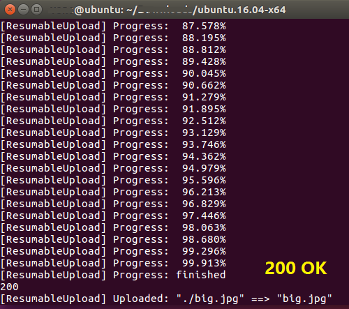
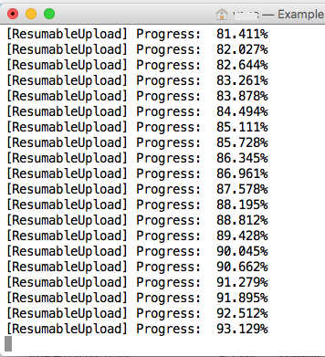

#C# SDK (.NET Core)

Qiniu (Storage) C# SDK for .NET Core

## How-to-use

Here is a step-by-step guide.

To get ready, if you need `dotnet` tool, see https://github.com/dotnet/cli/

###1. Create

Firstly, change to the working folder, and then create a project:

	dotnet new
	dotnet restore
	
**NOTE** that before `dotnet restore` you may modify the generated `project.json` file as follow:

	// project.json
	{
    	"version": "1.0.0-*",
    	"buildOptions": {
        	"emitEntryPoint": true
    	},

    	"dependencies": {
        	"Microsoft.NETCore.App": {
            	//"type": "platform",
            	"version": "1.0.1"
        	},
        	"Qiniu": "1.0.0",
        	"Newtonsoft.Json": "9.0.1"
    	},

    	"frameworks": {
        	"netcoreapp1.0": {
            	"imports": "dnxcore50"
        	}
    	},

    	"runtimes": {
			// Runtime for TARGET_OS
        	"win7-x64": {},
        	"win7-x86": {},
        	"osx.10.10-x64": {},
        	"osx.10.11-x64": {},
        	"ubuntu.14.04-x64": {},
			"ubuntu.16.04-x64": {}
    	}
	}

Then write your codes.

### 2. Publish

You may publish to the target os using command like one of them:

	dotnet publish -r win7-x64
	dotnet publish -r ubuntu.16.04-x64
	dotnet publish -r osx.10.11-x64

Or if you have .NET Core runtime installed, just build:

	dotnet build

### 3. Run

**NOTE that on OSX 10.11(EI Capitan)**, openssl must be installed before running your app:

	brew update
	brew install openssl
	brew link --force openssl
	ln -s /usr/local/opt/openssl/lib/libcrypto.1.0.0.dylib /usr/local/lib/
	ln -s /usr/local/opt/openssl/lib/libssl.1.0.0.dylib /usr/local/lib/

Say, if you would like to run the *built app* `Example.dll`, just type:

	dotnet Example.dll

In this case, you should have `dotnet` tool installed at the very begin.

Or if you want to run the *published app* `Example`, just double-click it. 

## Screenshots

**Ubuntu16.04-x64**

Uploading a big file (about 330MB):

Finished:

**OSX10.11-x64**

Uploading a big file (about 330MB):

Finished:

## About

Any questions and suggestions are appreciated.

You may visit [the author's website](http://fengyh.cn/)