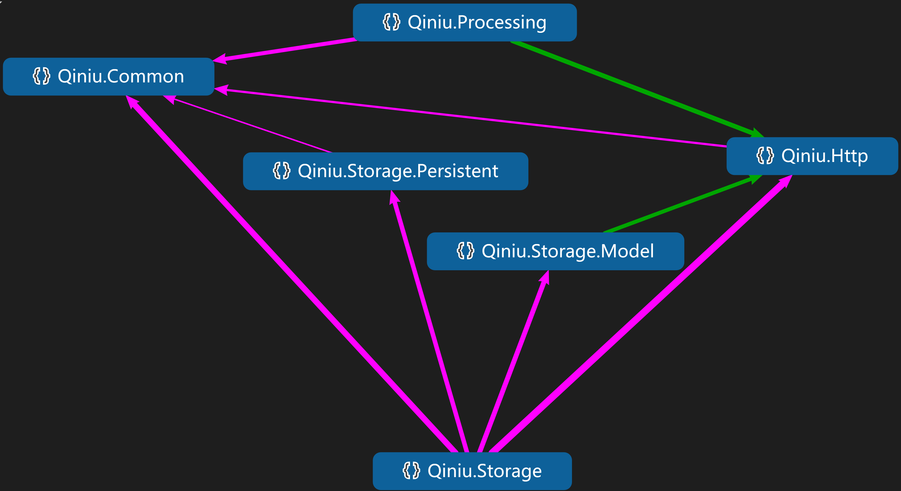
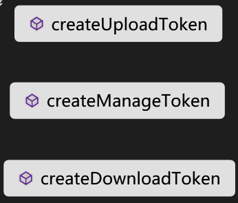
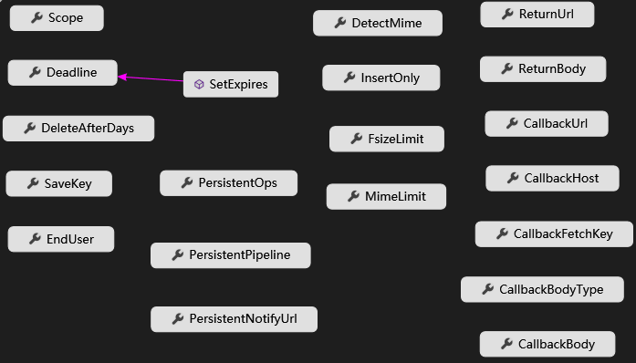
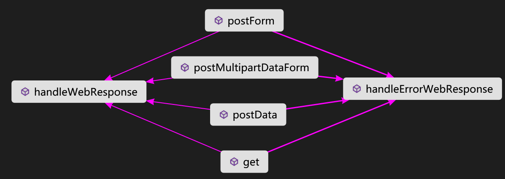
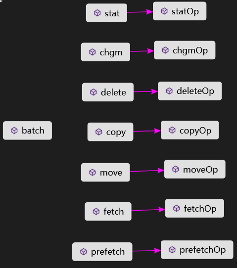
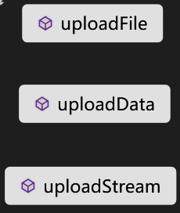
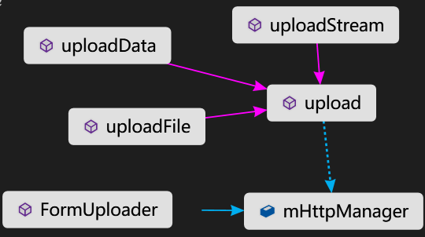
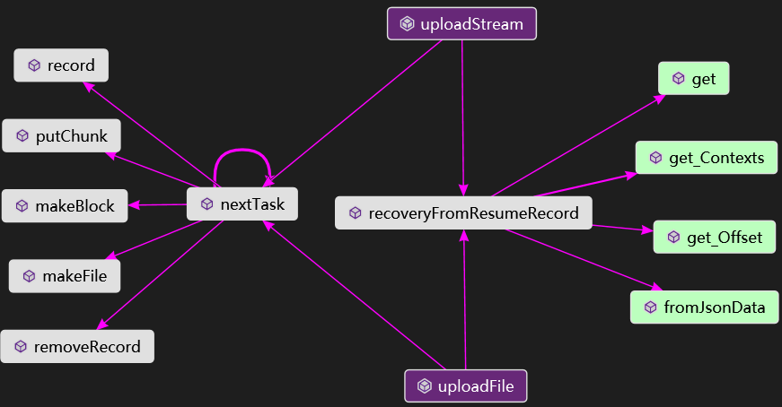
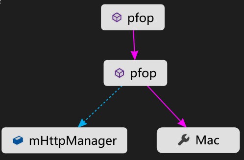

# Qiniu Resource (Cloud) Storage SDK for C# #

##关于

此 C# SDK 适用于.NET Framework 2.0以上版本，基于七牛云API参考手册构建。使用此 SDK 构建您的网络应用程序，能让您以非常便捷地方式将数据安全地存储到七牛云存储上。无论您的网络应用是一个网站程序，还是包括从云端（服务端程序）到终端（手持设备应用）的架构的服务或应用，通过七牛云存储及其 SDK，都能让您应用程序的终端用户高速上传和下载，同时也让您的服务端更加轻盈。

* 这个[C# SDK](https://github.com/qiniu/csharp-sdk)是最新版本，不同于之前版本(旧版本仍然可用)，推荐使用最新版本。

* 我们准备了一份编译好的打包文件(Qiniu.dll，.NET4.0)，点此[链接](https://github.com/qiniu/csharp-sdk/blob/master/build/csharp_sdk_latest.zip)下载。

###使用准备

####下载安装

######源码下载

    git clone https://github.com/qiniu/csharp-sdk

######添加引用

获取编译好的qiniu.dll后，在项目中添加Qiniu.dll引用

######附加依赖项

C# SDK引用了第三方的开源项目[Json.NET](http://www.newtonsoft.com/json)因此，您需要在项目中引用它，或者使用NuGet安装

    Install-Package Newtonsoft.Json

####秘钥配置

要接入七牛云存储，您需要拥有一对有效的 Access Key (以下简称AK) 和 Secret Key (以下简称SK) 用来进行签名认证。步骤如下：

1. 登录七牛开发者平台，查看 [AK 和 SK](https://portal.qiniu.com/user/key)，如果没有账号，可以开通一个[七牛开发者帐号](https://portal.qiniu.com/signup)

2. 在适当位置(比如程序中的settings模块)配置 AK & SK

3. 接下来就可以调用七牛API服务，如文件上传、数据处理等

###使用示例

在QSunSync和qiniulab这两个工具中，都用到了此SDK，研究它们的源代码也能帮助您更好地了解此SDK：

* [QSunSync](https://github.com/qiniu/QSunSync)
* [QiniulaLab](https://github.com/qiniu/qiniulab)

####上传文件

#####上传流程

为了尽可能地改善终端用户的上传体验，七牛云存储首创了客户端直传功能。更多信息请参阅[业务流程](http://developer.qiniu.com/article/developer/programming-model.html#workflow)。

#####普通上传

使用UploadManager，以下代码示意了如何使用UploadManager来上传一个本地文件

            // Let's begin
            UploadManager mgr = new UploadManager();
            
            // PutPolicy            
            PutPolicy putPolicy = new PutPolicy();
            putPolicy.Scope = Settings.Bucket;
            // 上传策略有效时间(建议时间3600秒)
            putPolicy.SetExpires(3600);
            // 过期(上传完毕1天后)自动删除
            putPolicy.DeleteAfterDays = 1;
            
            // UploadToken
            Mac mac = new Mac(Settings.AccessKey, Settings.SecretKey);            
            string token = Auth.createUploadToken(putPolicy, mac);
            
            string saveKey = "test_UploadManagerUploadFile.png";
            string localFile = "F:\\test.png";
            
            // Do it!
            mgr.uploadFile(localFile, saveKey, token, null, null);

#####断点续上传

使用ResumeUploader,可参考examples/ResumableUpload.cs代码

####文件下载

#####生成下载链接

生成授权下载链接 `ACC_URL = RAW_URL+Expire+Token`

比如原始链接 `RAW_URL = http://example.com/file/1.jpg`

加上过期时间戳(Expire)后 `http://example.com/file/1.jpg?e=1476783956`

然后Auth生成Token拼接上去 `http://example.com/file/1.jpg?e=1476783956&token=<TOKEN>`

示例代码

	using Qiniu.Util;
	// AK = "ACCESS_KEY"
	// SK = "SECRET_KEY"
	// 加上过期参数，使用 ?e=<UnixTimestamp>
	// 如果rawUrl中已包含?，则改用&e=<UnixTimestamp>
	// rawURL = "RAW_URL" + "?e=1482207600"; 
	Mac mac = new Mac(AK,SK);
	string token = Auth.createDownloadToken(rawUrl, mac);
	string signedURL = rawURL + "&token=" + token;

####空间资源管理

#####简单处理

支持stat、copy、move、delete,listFiles等，具体可参阅BucketManager模块说明。

######关于获取空间文件列表(listFiles)的说明：
 
    METHOD:    listFiles(bucket, prefix, marker, limit, delimiter)
	-----------------------------------------------------------------------
    bucket:    目标空间名称
    prefix:    返回指定文件名前缀的文件列表(prefix可设为null)
    marker:    考虑到设置limit后返回的文件列表可能不全(需要重复执行listFiles操作)
               执行listFiles操作时使用marker标记来追加新的结果
               特别注意首次执行listFiles操作时marker为null               
    limit:     每次返回结果所包含的文件总数限制(limit<=1000，建议值100)
    delimiter: 分隔符，比如-或者/等等，可以模拟作为目录结构(参考下述示例)
               假设指定空间中有2个文件 fakepath/1.txt fakepath/2.txt
               现设置delimiter=/ 得到结果items =[]，commonPrefixes = [fakepath/]
			   调整prefix=fakepath/ delimiter=null 得到所需结果items=[1.txt,2.txt]
               于是可以在本地先创建一个目录fakepath,然后在该目录下写入items中的文件

#####批量处理

batch批处理:

/batch

op= < op1 > &op= < op2 >...

可参考examples/BucketFileManagemt.cs中的相关代码

#####新特性:force参数

move/copy支持force参数，另请参阅[资源复制的force参数](http://developer.qiniu.com/code/v6/api/kodo-api/rs/copy.html)

####持久化操作

如：fops = vframe/jpg/offset/1/w/480/h/360/rotate/90 表示视频截图。

###SDK结构

#####总体框架

C# SDK的总体框架如下图

主要包含Auth、PutPolicy、Storage、Http、Processing等模块

######Auth

得到上传/管理/下载凭证。

另请参阅：[上传凭证](http://developer.qiniu.com/article/developer/security/upload-token.html)

######PutPolicy

上传策略，主要是一些参数设置。

另请参阅：[上传策略](http://developer.qiniu.com/article/developer/security/put-policy.html) 

######HttpManager

HttpManager模块负责HTTP请求与响应。

######BucketManager

BucketManager模块支持对空间文件的各种操作，如stat,copy,move等，支持批量操作(batch)。

######UploadManager

上传管理器：可以通过该上传管理器自动判断上传的内容是采用表单上传还是分片上传。

* 对于二进制数据和文件流，目前仅支持表单上传

* 对于沙盒文件，目前支持以表单方式和分片方式上传

######FormUploader

以表单的方式上传文件/字节数据/数据流

######ResumeUploader

文件分片上传，支持文件/数据流

######Pfop

持久化，可以配合上传使用，比如上传complete事件触发数据处理。

###API参考手册

* [对象存储API参考手册](http://developer.qiniu.com/article/index.html#kodo-api-handbook)

* [数据处理API参考手册](http://developer.qiniu.com/article/index.html#dora-api-handbook)

###相关资源

如果您有任何关于我们文档或产品的建议和想法，欢迎到我们的技术论坛参与讨论。

* [技术论坛](http://segmentfault.com/qiniu) - 在这里您可以和其他开发者愉快的讨论如何更好的使用七牛云服务

* [提交工单](http://support.qiniu.com/hc/request/guest/) - 如果您的问题不适合在论坛讨论或得不到回答，您也可以提交一个工单，技术支持人员会尽快回复您

* [博客](http://blog.qiniu.com/) - 这里会持续发布市场活动和技术分享文章

* [微博](http://weibo.com/qiniutek)

* [常见问题](http://developer.qiniu.com/article/faqs/)

####贡献代码

1. Fork

2. 创建您的特性分支 git checkout -b my-new-feature

3. 提交您的改动 git commit -am 'Added some feature'

4. 将您的修改记录提交到远程 git 仓库 git push origin my-new-feature

5. 然后到 github 网站的该 git 远程仓库的 my-new-feature 分支下发起 Pull Request

###许可证

Copyright (c) 2016 [qiniu.com](www.qiniu.com/)

基于 MIT 协议发布:

www.opensource.org/licenses/MIT

