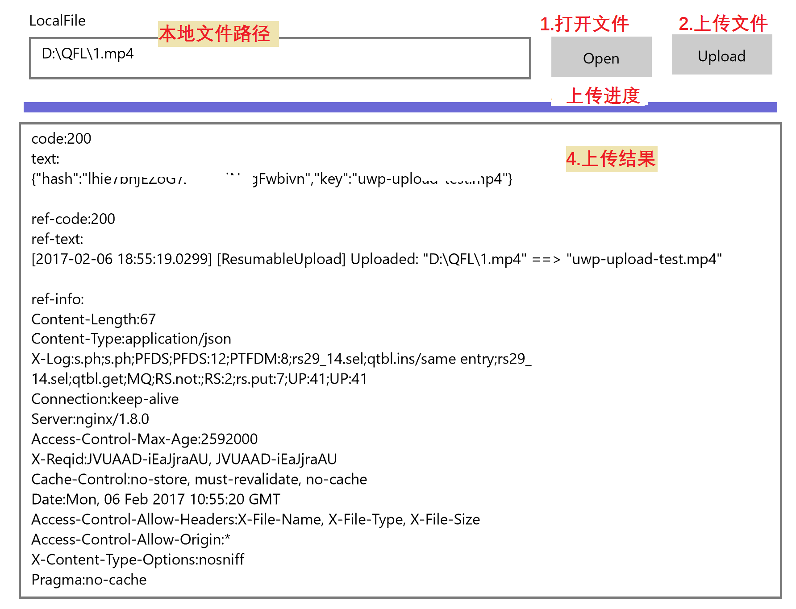

#Qiniu (Cloud) C# SDK Examples

##如何编译

推荐使用VS2013及以上版，根据目标平台选择对应的解决方案文件并打开：

| 目标 | 解决方案文件 |
|--------|--------|
| .NET Framework 2.0 | Examples.Net20.sln |
| .NET Framework 3.5 | Examples.Net35.sln |
| .NET Framework 4.0+ | Examples.Net40.sln |
| .NET Core | Examples.NetCore.sln |
| Win10 UWP | Examples.UWP.sln |

**注意**

如需编译`Qiniu.NetCore`，请先将`project.json`和`project.lock.json`拷贝至`Qiniu`文件夹下，或者拷贝`project.json`文件然后执行`dotnet restore`命令（推荐）。

如需编译其他非NetCore版本，请删除`Qiniu`文件夹下的`project.json`和`project.lock.json`（如果有）。

UWP example screenshots

